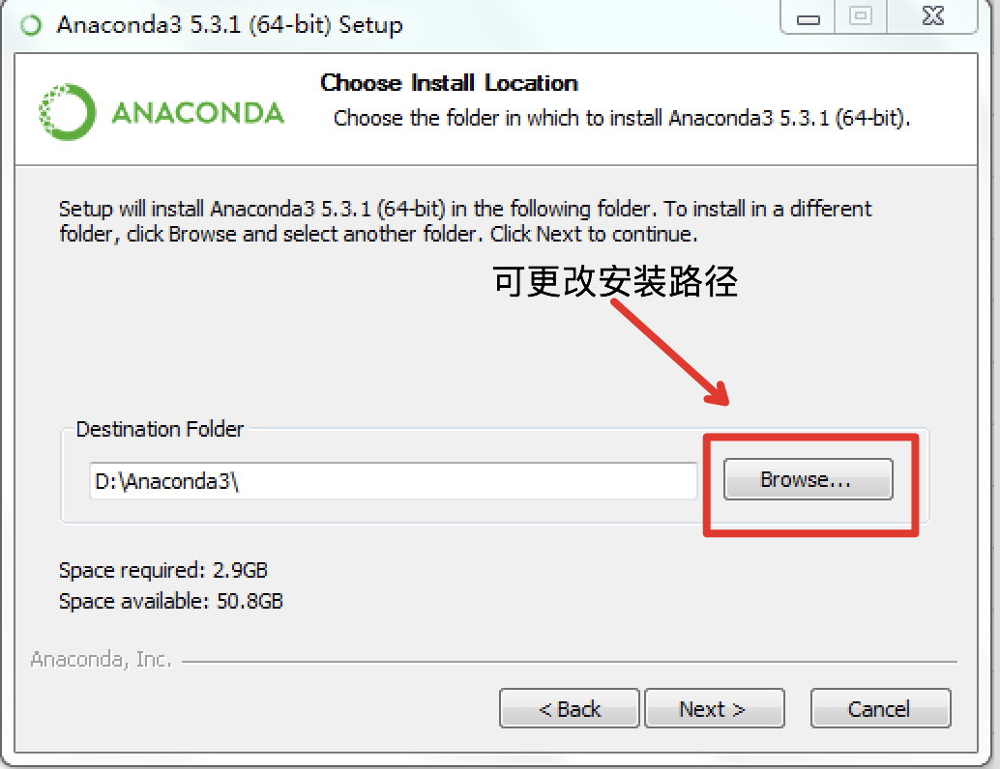

# Anaconda installation and use
Anaconda is an open source Python released version which contains more than 180 science packages and their dependencies such as conda and Python. By creating multiple independent Python environments, the use of Anaconda can avoid conflict due to too many different version dependencies installed in your Python environment.

## Installing Anaconda on Windows
### Step 1: Download
- Download Windows Python 3.7 64-Bit version from the Anaconda website [(https://www.anaconda.com/products/individual) . ](https://www.anaconda.com/products/individual)
- Make sure that `Visual C++ Build Tools` is installed (you can find it in the start menu). If not, download and install it.[ ](https://go.microsoft.com/fwlink/?LinkId=691126)

### Step 2 Install
Run the downloaded installation package (.exe as a suffix). According to the guide, complete the installation. Users can modify the installation directory as required (see the following). 

### Step 3 Use
- Click the Windows icon in the bottom left corner of the Windows system and start it by choosing All Programs->Anaconda3/2 (64-bit)->Anaconda Prompt.
- Execute the following command on the command line
```cmd
# Create an environment named my_paddlex and specify Python version 3.7. conda create -n my_paddlex python=3.7 # Enter the my_paddlex environment conda activate my_paddlex # Install git conda install git # Install pycocotools pip install cython pip install git+https://gitee.com/jiangjiajun/philferriere-cocoapi.git#subdirectory=PythonAPI # Install paddlepaddle-gpu pip install paddlepaddle -i https://mirror.baidu.com/pypi/simple # Install paddlex pip install paddlex -i https://mirror.baidu.com/pypi/simple
```
After the configurations are finished, you can use PaddleX in the environment. Enter `python` into the command line, and press Enter. Try `import paddlex`. You can use it again by choosing All Programs->Anaconda3/2 (64-bit)->Anaconda Prompt, and execute `conda activate my_paddlex` to enter the environment.

## Linux/Mac installation

### Step 1: Download
Go to the Anaconda website [(https://www.anaconda. com/products/individual) to download the corresponding system Python 3.7 version (for Mac, download Command Line Installer version). ](https://www.anaconda.com/products/individual)

### Step 2 Install
Open the terminal and install Anaconda in the terminal
```
# ~/Downloads/Anaconda3-2019.07-Linux-x86_64.sh is the downloaded file bash ~/Downloads/Anaconda3-2019.07-Linux-x86_64.sh
```
During the installation, you just need to press Enter. If you are prompted to set the installation path, you can modify it as required. Generally, you need to follow the default installation.

### Step 3 Use
```
# Create an environment named my_paddlex and specify Python version 3.7. conda create -n my_paddlex python=3.7 # Enter the paddlex environment conda activate my_paddlex # Install pycocotools pip install cython pip install pycocotools # Install paddlepaddle-gpu pip install paddlepaddle -i https://mirror.baidu.com/pypi/simple # Install paddlex pip install paddlex -i https://mirror.baidu.com/pypi/simple
```
After the above configurations, you can use PaddleX in the environment. After entering `python` in the terminal and pressing Enter, try `import paddlex`. After that, just open the terminal and execute `conda activate my_paddlex` to enter the environment and you can use paddlex again.
