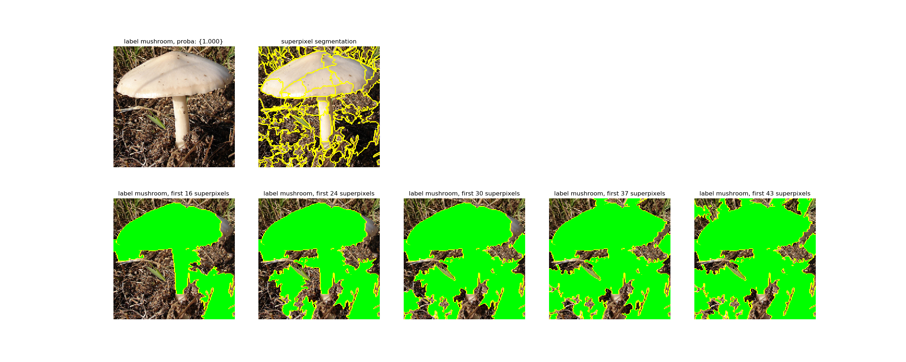
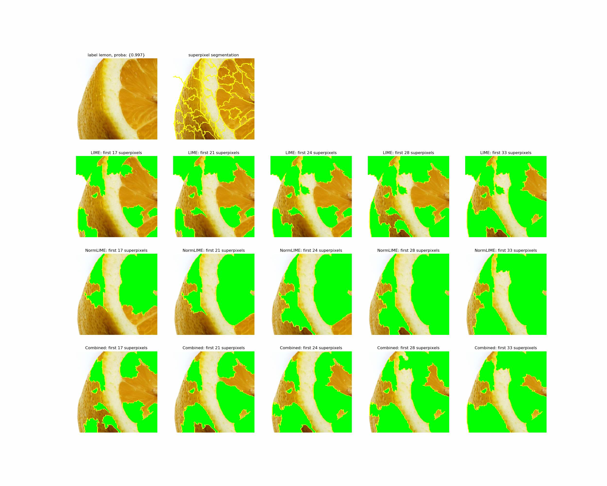

# PaddleX interpretability

There is a frequently occurring problem with deep learning: the model is currently a black box, and it is almost impossible to perceive its internal workings, and the reliability of the prediction results has been questioned. For this reason, PadlleX provides two algorithms to perform interpretable research on image classification prediction results: LIME and NormLIME.

## LIME
The Local interpretable model-agnostic explanations (LIME) indicates a model-independent local interpretability. The main steps in its implementation are as follows.
1. Acquire the image's superpixels.
2. Centered on the input sample, take random samples in the space around it. Each sample is a random mask of the superpixel in the sample (the weight of each sample is inversely proportional to the distance of that sample from the original sample).
3. Each sample has a new output through the prediction model`.` In this way, series of inputs `X` and corresponding output Y are obtained.
4. X` is converted to a superpixel feature `F`. A simple and interpretable `Model` (here using Ridge regression) is used to fit the mapping between F and `Y`.` ``
5. `The `Model` obtains the weight of each input dimension of `F (each dimension represents a superpixel).

For the usage of LIME, see code examples and API introduction[.](https://github.com/PaddlePaddle/PaddleX/blob/develop/tutorials/interpret/lime.py)The setting of the [num_samples](../apis/visualize.html#lime) parameter is especially important. It indicates the number of random samples in Step 2. If it is set to a value, too small the stability of the interpretable result is affected. If it is set to a value, too large, it takes a long time in step 3. The parameter batch_size` indicates that it takes longer time in step 3 if it is set too small, and the upper limit is determined by the computer configuration.```

The visualization result of the final LIME interpretable algorithm is as follows: the green area represents the positive superpixels, the red area represents the negative superpixels, and "First n superpixels" represents the first n superpixels with higher weight (calculated from step 5). 


## NormLIME
NormLIME is an improvement on LIME, where the interpretation of LIME is local and a specific interpretation for the current sample. NormLIME is a global interpretation of the current sample using a certain number of samples, with a certain noise reduction effect. Its implementation steps are as follows:
1. Download the Kmeans model parameters and the first three layers of the ResNet50_vc network parameters. (The parameters of ResNet50_vc are the parameters of the network obtained by training on ImageNet; using ImageNet images as a dataset, each image extracts the average feature on the corresponding super pixel position and the feature on the center of mass from the third layer output of ResNet50_vc, and the Kmeans model is obtained through training here)
2. Calculate the weight information of normlime using the data in the test set (if no test set is available, use the validation set instead). For each image: (1) Get the image's superpixel. (2) Use ResNet50_vc to obtain the feature of the third layer . Combine the prime and mean features `F` for each superpixel location. (3) Use `F` as input to the Kmeans model to calculate the clustering center for each superpixel location. (4) Use the trained classification model, and predict the `label` for that image . For all images: (1) Take a vector consisting of information about the clustering centers of each image (set to 1 if a cluster center appears on the way to stamping and 0 otherwise) as an input. The predicted `label` is the output`.` Construct the logic regression function regression_func`.`(2) Based on the regression_func, obtain the weights of each cluster center under different categories, and normalize the weights.
3. Use the Kmeans model to obtain the clustering center for each superpixel of the image to be visualized.
4. A new image is constructed by randomly masking the superpixels of the image to be visualized.
5. Predict the label for each constructed image using a prediction model.
6. According to the weight information of normlime, each superpixel is given a different weight. The highest weight is selected as the final weight to interpret the model.

For the usage of NormalLIME, refer to the code example and api description[.](https://github.com/PaddlePaddle/PaddleX/blob/develop/tutorials/interpret/normlime.py)The parameter [num_samples](../apis/visualize.html#normlime) is especially important, it indicates the number of random samples in step 2. If it is set too small, the stability of the interpretable result is affected. If it is set too large, it takes a long time in step 3. The parameter batch_size` indicates that: if it is set too small, it takes a long time in step 3, and the upper limit is decided in the machine configuration. The `dataset` is the data constructed by the test set or validation set.```

The visualization results of the final NormLIME interpretable algorithm are as follows: the green area represents the positive superpixels, the red area represents the negative superpixels, and "First n superpixels" represents the first n superpixels with larger weight (calculated in step 5). The last row represents the result of multiplying the weights of LIME and NormLIME corresponding superpixels.
