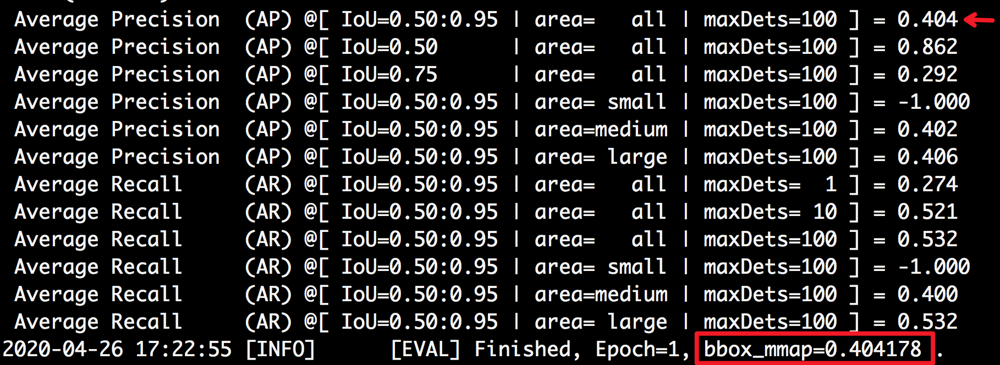
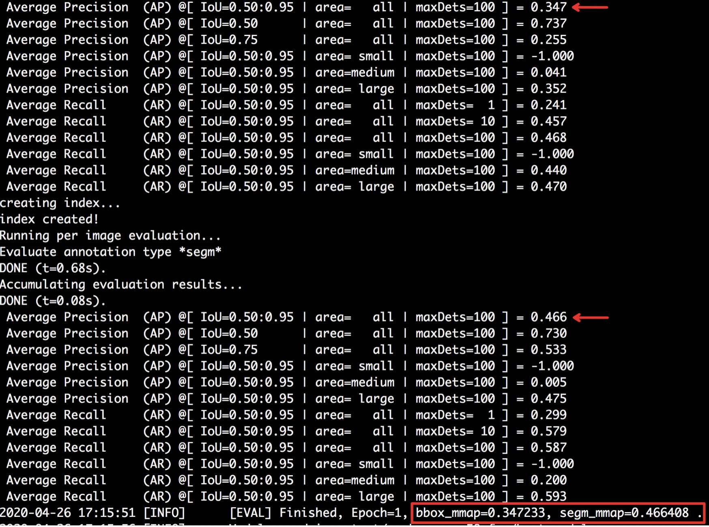

# PaddleX metrics and log

PaddleX has logs and metrics that are fed back during model training and evaluation. This document describes the meanings of logs and metrics.

## Generic training statistics

The output log information of all PaddleX models during training contains six common statistics that are used to assist users in model training, for example, training log for segmentation models. See the following.** **

The meaning of each field is as follows:

| Field | Example of field value | Meaning |
| -------------- | -------------------- | ------------------------------------------------------------ |
| Epoch | Epoch=4/20 | [[Iteration epoch] All training data is trained for 20 rounds. Currently it is at round 4] |
| Step | Step=62/66 | [[Iteration Steps] The number of iteration steps required for all training data to be trained for a round is 66. Currently, it is at step 62] |
| Loss | loss=0.007226 | [[Loss function] It participates in the average loss function value of the training sample for the current iteration step. The lower the loss value, the better the model fits on the training set (For example, Line 1 in the above log indicates that the 62nd Batch of the 4th epoch has a loss value of 0.007226)] |
| Lr | lr=0.008215 | [[Learning rate] It is the learning rate in the current model iteration process.] |
| time_each_step | time_each_step=0.41s | [[Average time per iteration] It is the average time consumption calculated from the training process for each iteration step] |
| eta | eta=0:9:44 | [[Remaining time] Model remaining completion time required to complete the training is estimated to be 0 hours 9 minutes 44 seconds] |
|  |  |  |

In addition to the above general fields, there are other fields in the logs of the different models. For the meanings of these fields, see the description of each task model.

## Evaluate generic statistical information

All models in PaddleX are evaluated and saved at regular intervals during the training process according to the `save_interval_epochs` parameter set by the user. For example, the evaluation log for the classification model is shown in the figure below.****

The first line in the above figure indicates that the number of samples in the validation dataset is 240. It takes 8 iteration steps to evaluate all the validation data; the fifth line indicates that the second round of the model completes the saving operation; the sixth line indicates: In the current saving model, the second-round model has the optimal metrics in the validation set (see `acc1` for the classification task, and the value of acc1 is 0.258333). The optimal model is saved in the `best_model` directory.``

## Classify specific statistic information

### Training log field

The training log for the classification task includes two specific fields `acc1` and `acc5`, in addition to generic statistics.

> Note: The acc accuracy is calculated for a single image: the prediction scores of the model on each category are sorted from in the descending order, the top k prediction categories are taken out. If these k prediction categories contain the true value, the image is considered to be correctly classified.

The `acc1` in Line 1 of the above figure represents the average top1 accuracy of the training samples participating in the current iterations, and the higher values indicates the better model. `acc5` represents the average top5 (topn if the number of categories n is less than 5) accuracy of the training samples participating in the current iteration of steps, and the higher value indicates the better model. The `loss` in line 4 represents the average loss function value for the entire training set. `acc1` indicates the average top1 accuracy for the entire training set, and `acc5` indicates the average top5 accuracy for the entire training set.

### Evaluate the log field

acc1` in Line 3 of the above figure represents the average top1 accuracy of the entire validation set, and `acc5` represents the average top5 accuracy of the entire validation set.`

## Detect specific statistical information

### Training log field

#### YOLOv3

YOLOv3's training log includes only training generic statistics (see Training Generic Statistics above).

The `loss` in Line 5 in the above figure represents the average loss function (loss) value for the entire training set.

#### FasterRCNN

FasterRCNN's training log includes, in addition to generic statistics, `loss_cls`, `loss_bbox`, `loss_rpn_cls`, and `loss_rpn_bbox`. The meanings of the fields are as follows:

| Field | Meaning |
| -------------- | --------------------------------------------- |
| loss_cls | Classification of loss function values in RCNN subnet |
| loss_bbox | Detection box regression loss function values in RCNN subnet |
| loss_rpn_cls | Classification loss function values in RPN subnet |
| loss_rpn_bbox | Detection box regression loss function value in RPN subnet |
| Loss | Sum of all subnet loss function values |

In the above figure`, `loss`, `loss_cls`, `loss_bbox`, `loss_rpn_clss`, and `loss_rpn_bbox in Line 1 are all the loss values of the training samples participating in the current iteration step, while Line 7 is the loss function value for the entire training set.

#### MaskRCNN

MaskRCNN's training log includes, in addition to generic statistics, `loss_cls`, `loss_bbox`, `loss_mask`, `loss_rpn_cls`, and `loss_rpn_bbox`. The meanings of the fields are as follows:

| Field | Meaning |
| -------------- | --------------------------------------------- |
| loss_cls | Classification of loss function values in RCNN subnet |
| loss_bbox | Detection box regression loss function values in RCNN subnet |
| loss_mask | Mask regression loss function values in RCNN subnet |
| loss_rpn_cls | Classification loss function values in RPN subnet |
| loss_rpn_bbox | Detection box regression loss function value in RPN subnet |
| Loss | Sum of all subnet loss function values |

In the above figure`, `loss`, `loss_cls`, `loss_bbox`, `loss_mask`, `loss_rpn_clss`, and `loss_rpn_bbox in Line 1 are all loss values for the training samples participating in the current iteration step, and line 7 is the loss function value for the entire training set.

### Evaluate the log field

Two evaluation standards can be used for detection: VOC evaluation standard and COCO evaluation standard.

#### VOC evaluation standard

> Note: `map` is the average value of the average accuracy, that is, the average of the area under the accuracy-recall curve for each category when Intersection Over Union (IoU) is set to 0.5.

Line 3 of the `bbox_map` in the above figure shows the average accuracy of the entire validation set for the detection task.

#### COCO evaluation standard

> Note: for the COCO evaluation metrics, see COCO official website for details .[PaddleX mainly feeds back ](http://cocodataset.org/#detection-eval)mmAP . That is, AP at IoU=.50:.05:.95 metric is the average of the mAP at each IoU threshold.``

The COCO-formatted dataset can be used to train not only object detection models, but also training instance segmentation models. In object detection, PaddleX mainly feeds the `bbox_mmAP` metric against the detection box. For the instance segmentation, it also includes the `seg_mmAP` metric against the Mask. As shown below, the first log screenshot shows the evaluation result of the object detection, and the second log screenshot shows the evaluation result of instance segmentation.

The `bbox_mmap` marked by the red box in the above figure represents the average accuracy of the detection boxes for the entire validation set.

The bbox_mmap` and `seg_mmap` marked in the red box in the above figure represent the average accuracy of the detection box averaged over the entire validation set, and the average accuracy of the Mask averaged over the entire validation set, respectively.`

## Segmentation of specific statistics

### Training log field

Training logs for semantic segmentation include only training generic statistics (see Training Generic Statistics above).

### Evaluate the log field

The evaluation log for semantic partitioning includes the fields `miou`, `category_iou`, `macc`, `category_acc`, and `kappa`. The meanings are as follows:

| Field | Meaning |
| -------------- | --------------------------------------------- |
| mIOU | Average value of each type of IoU |
| category_iou | Various types of IoU |
| macc | Average accuracy, that is, the number of pixels correctly predicted / total number of pixels |
| category_acc | Accuracy for each category, that is, the number of pixels correctly predicted for each category / total number of pixels predicted for that category |
| Kappa | kappa coefficient. It is used for consistency validation. |

