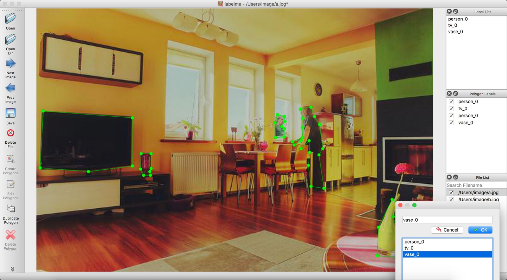

# Semantic Segmentation

语义数据的标注推荐使用LabelMe标注工具，如您先前并无安装，那么LabelMe的安装可参考[LabelMe安装和启动](labelme.md)，语义分割的标注与实例分割类似，流程如下

**注意：LabelMe对于中文支持不够友好，因此请不要在如下的路径以及文件名中出现中文字符!**

## Preparation    

1. 将收集的图像存放于`JPEGImages`文件夹下，例如存储在`D:\MyDataset\JPEGImages`
2. 创建与图像文件夹相对应的文件夹`Annotations`，用于存储标注的json文件，如`D:MyDataset\Annotations`
3. 打开LabelMe，点击”Open Dir“按钮，选择需要标注的图像所在的文件夹打开，则”File List“对话框中会显示所有图像所对应的绝对路径，接着便可以开始遍历每张图像，进行标注工作      

## Target edge annotation    

1. 打开多边形标注工具（右键菜单->Create Polygon)以打点的方式圈出目标的轮廓，并在弹出的对话框中写明对应label（当label已存在时点击即可，此处请注意label勿使用中文），具体如下提所示，当框标注错误时，可点击左侧的“Edit Polygons”再点击标注框，通过拖拉进行修改，也可再点击“Delete Polygon”进行删除。


2. 点击右侧”Save“，将标注结果保存到中创建的文件夹Annotations目录中

## Format conversion

LabelMe标注后的数据还需要进行转换为SEG格式，才可以用于语义分割任务的训练，创建保存目录`D:\dataset_seg`，在python环境中安装paddlex后，使用如下命令即可
```
paddlex --data_conversion --source labelme --to SEG \
        --pics D:\MyDataset\JPEGImages \
        --annotations D:\MyDataset\Annotations \
        --save_dir D:\dataset_seg
```

## Dataset partition

转换完数据后，为了进行训练，还需要将数据划分为训练集、验证集和测试集，同样在安装paddlex后，使用如下命令即可将数据划分为70%训练集，20%验证集和10%的测试集
```
paddlex --split_dataset --format SEG --dataset_dir D:\MyDataset --val_value 0.2 --test_value 0.1
```
执行上面命令行，会在`D:\MyDataset`下生成`train_list.txt`, `val_list.txt`, `test_list.txt`，分别存储训练样本信息，验证样本信息，测试样本信息

> 注：如您使用PaddleX可视化客户端进行模型训练，数据集划分功能集成在客户端内，无需自行使用命令划分


- [语义分割任务训练示例代码](https://github.com/PaddlePaddle/PaddleX/blob/develop/tutorials/train/semantic_segmentation/deeplabv3p_xception65.py)

