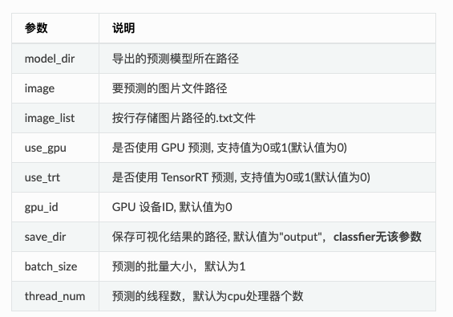
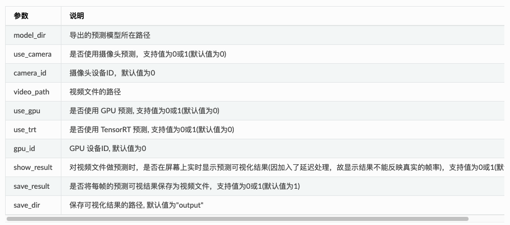

# Nvidia Jetson开发板

## 说明
本文档在基于Nvidia Jetpack 4.4的`Linux`平台上使用`GCC 7.4`测试过，如需使用不同G++版本，则需要重新编译Paddle预测库，请参考: [NVIDIA Jetson嵌入式硬件预测库源码编译](https://www.paddlepaddle.org.cn/documentation/docs/zh/develop/advanced_guide/inference_deployment/inference/build_and_install_lib_cn.html#id12)。

## 前置条件
* G++ 7.4
* CUDA 10.0 / CUDNN 8 （仅在使用GPU版本的预测库时需要）
* CMake 3.0+

请确保系统已经安装好上述基本软件，**下面所有示例以工作目录 `/root/projects/`演示**。

### Step1: 下载代码

 `git clone https://github.com/PaddlePaddle/PaddleX.git`

**说明**：其中`C++`预测代码在`PaddleX/deploy/cpp` 目录，该目录不依赖任何`PaddleX`下其他目录。


### Step2: 下载PaddlePaddle C++ 预测库 paddle_inference

目前PaddlePaddle为Nvidia Jetson提供了一个基于1.6.2版本的C++ 预测库。


下载并解压后`/root/projects/fluid_inference`目录包含内容为：
```
fluid_inference
├── paddle # paddle核心库和头文件
|
├── third_party # 第三方依赖库和头文件
|
└── version.txt # 版本和编译信息
```

### Step3: 编译

编译`cmake`的命令在`scripts/jetson_build.sh`中，请根据实际情况修改主要参数，其主要内容说明如下：
```
# 是否使用GPU(即是否使用 CUDA)
WITH_GPU=OFF
# 使用MKL or openblas
WITH_MKL=OFF
# 是否集成 TensorRT(仅WITH_GPU=ON 有效)
WITH_TENSORRT=OFF
# TensorRT 的路径，如果需要集成TensorRT，需修改为您实际安装的TensorRT路径
TENSORRT_DIR=/root/projects/TensorRT/
# Paddle 预测库路径, 请修改为您实际安装的预测库路径
PADDLE_DIR=/root/projects/fluid_inference
# Paddle 的预测库是否使用静态库来编译
# 使用TensorRT时，Paddle的预测库通常为动态库
WITH_STATIC_LIB=OFF
# CUDA 的 lib 路径
CUDA_LIB=/usr/local/cuda/lib64
# CUDNN 的 lib 路径
CUDNN_LIB=/usr/local/cuda/lib64

# 以下无需改动
rm -rf build
mkdir -p build
cd build
cmake .. \
    -DWITH_GPU=${WITH_GPU} \
    -DWITH_MKL=${WITH_MKL} \
    -DWITH_TENSORRT=${WITH_TENSORRT} \
    -DWITH_ENCRYPTION=${WITH_ENCRYPTION} \
    -DTENSORRT_DIR=${TENSORRT_DIR} \
    -DPADDLE_DIR=${PADDLE_DIR} \
    -DWITH_STATIC_LIB=${WITH_STATIC_LIB} \
    -DCUDA_LIB=${CUDA_LIB} \
    -DCUDNN_LIB=${CUDNN_LIB}
make
```
**注意：** linux环境下编译会自动下载YAML，如果编译环境无法访问外网，可手动下载：

- [yaml-cpp.zip](https://bj.bcebos.com/paddlex/deploy/deps/yaml-cpp.zip)

yaml-cpp.zip文件下载后无需解压，在cmake/yaml.cmake中将`URL https://bj.bcebos.com/paddlex/deploy/deps/yaml-cpp.zip` 中的网址，改为下载文件的路径。

修改脚本设置好主要参数后，执行`build`脚本：
 ```shell
 sh ./scripts/jetson_build.sh
 ```

### Step4: 预测及可视化

**在加载模型前，请检查你的模型目录中文件应该包括`model.yml`、`__model__`和`__params__`三个文件。如若不满足这个条件，请参考[模型导出为Inference文档](export_model.md)将模型导出为部署格式。**  

* 编译成功后，图片预测demo的可执行程序分别为`build/demo/detector`，`build/demo/classifier`，`build/demo/segmenter`，用户可根据自己的模型类型选择，其主要命令参数说明如下：



* 编译成功后，视频预测demo的可执行程序分别为`build/demo/video_detector`，`build/demo/video_classifier`，`build/demo/video_segmenter`，用户可根据自己的模型类型选择，其主要命令参数说明如下：



**注意：若系统无GUI，则不要将show_result设置为1。当使用摄像头预测时，按`ESC`键可关闭摄像头并推出预测程序。**


## 样例

可使用[小度熊识别模型](export_model.md)中导出的`inference_model`和测试图片进行预测，导出到/root/projects，模型路径为/root/projects/inference_model。

`样例一`：

不使用`GPU`测试图片 `/root/projects/images/xiaoduxiong.jpeg`  

```shell
./build/demo/detector --model_dir=/root/projects/inference_model --image=/root/projects/images/xiaoduxiong.jpeg --save_dir=output
```
图片文件`可视化预测结果`会保存在`save_dir`参数设置的目录下。


`样例二`:

使用`GPU`预测多个图片`/root/projects/image_list.txt`，image_list.txt内容的格式如下：
```
/root/projects/images/xiaoduxiong1.jpeg
/root/projects/images/xiaoduxiong2.jpeg
...
/root/projects/images/xiaoduxiongn.jpeg
```
```shell
./build/demo/detector --model_dir=/root/projects/inference_model --image_list=/root/projects/images_list.txt --use_gpu=1 --save_dir=output --batch_size=2 --thread_num=2
```
图片文件`可视化预测结果`会保存在`save_dir`参数设置的目录下。

**样例三：**

使用摄像头预测：

```shell
./build/demo/video_detector --model_dir=/root/projects/inference_model --use_camera=1 --use_gpu=1 --save_dir=output --save_result=1
```
当`save_result`设置为1时，`可视化预测结果`会以视频文件的格式保存在`save_dir`参数设置的目录下。

**样例四：**

对视频文件进行预测：

```shell
./build/demo/video_detector --model_dir=/root/projects/inference_model --video_path=/path/to/video_file --use_gpu=1 --save_dir=output --show_result=1 --save_result=1
```
当`save_result`设置为1时，`可视化预测结果`会以视频文件的格式保存在`save_dir`参数设置的目录下。如果系统有GUI，通过将`show_result`设置为1在屏幕上观看可视化预测结果。
