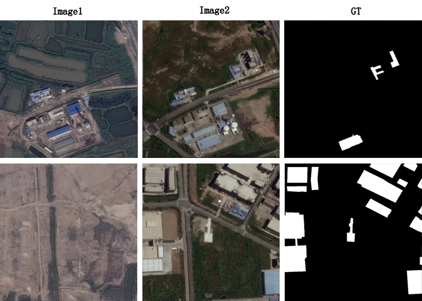

# Plot change detection

This case implements the plot change detection based on PaddleX, that is, two images of the same plot in the early stage and late stage are stitched together and then input to the semantic segmentation network for predicting the change of the area. In the training phase, a variety of data enhancement strategies such as random scaling size, rotation, pruning, color space perturbation, horizontal flipping, and vertical flipping are used. In the validation and prediction phases, sliding window prediction is used to avoid insufficiency of display memory when large-size images are directly predicted.

#### pre-dependence

* Paddle paddle >= 1.8.4
* Python >= 3.5
* PaddleX >= 1.2.2

For installation related issues, refer to [PaddleX Installation]. (../install.md)

Download PaddleX source code:

```
git clone https://github.com/PaddlePaddle/PaddleX
```

All scripts of this case are located in `PaddleX/examples/change_detection/`. Access the directory:

```
cd PaddleX/examples/change_detection/
```

## Data preparation

This case uses the [Google Dataset] (https://github.com/daifeng2016/Change-Detection-Dataset-for-High-Resolution-Satellite-Imagery) developed by [Daifeng Peng, etc.](https://ieeexplore.ieee.org/document/9161009). The dataset covers changes in houses and buildings in partial areas in Guangzhou from 2006 to 2019 for analyzing the urbanization process.[There are 20 pairs of high-resolution images in red, green and blue bands with a spatial resolution of 0.55m, and image sizes range from 1006x1168 to 4936x5224.

Google Dataset only marks whether the houses and buildings are changed; therefore, this case is a two-class change detection task, which can be extended to the multi-class change detection by modifying the number of classes according to actual needs.

In this case, 15 images are categorized into the training set and 5 images are categorized into the validation set. Since the size of the images is too large, direct training may cause the problem of insufficient display memory, the training images are divided according to the sliding window (1024, 1024) and step (512, 512). There are 743 pictures in the training set after the division. Divide the validation pictures based on a sliding window of (769, 769) and a step of (769, 769) to get 108 sub-pictures for validation during training.

Run the following script to download the original dataset and complete the cut of the dataset.

```
python prepare_data.py
```

Data after division is as follows:




**Note:**

* PaddleX uses the gdal library to read tiff images. For the installation of gdal, see the reference [document](https://paddlex.readthedocs.io/zh_CN/develop/examples/multi-channel_remote_sensing/README.html#id2) . For RGB pictures in tiff, if you don't want to install gdal, you need to convert pictures to formats such as jpeg, bmp, or png.

* The label file should be a single-channel image in png format, and the labels start counting from 0, the label 255 means the category is not involved in the calculation. For example, in this case, 0 means `unchanged` class, 1 means `changed` class.

## Model training

Due to the small amount of data, choose the UNet model for the segmentation model, because it features both shallow details and deep semantic information. Run the following script to carry out the model training:

```
python train.py
```

You can change the number of GPU cards and setting value of `train_batch_size` in the training script according to the actual video memory size, and then adjust the `learning_rate` according to the adjustment ratio of `train_batch_size` For example, when `train_batch_size` decreases from 16 to 8, learning_rate decreases from 0.1 to 0.05.`In addition, the `learning_rate` corresponding to the optimal precision obtained on different datasets may vary. You can try to adjust it.

It is also possible to skip the model training step and directly download the pre-training model for subsequent model evaluation and prediction.

```
wget https://bj.bcebos. com/paddlex/examples/change_detection/models/google_change_det_model.tar.gz tar -xvf google_change_detection_model.tar.gz
```

## Model evaluation

During the training process, the precision of the model in the validation set is evaluated every 10 iteration rounds. The original large size images are sliced into smaller blocks in advance. Therefore, it means that a non-overlapping sliding-window prediction method is used. The optimal model precision:

| mean_iou | category__iou | overall_accuracy | category_accuracy | category_F1-score | kappa |
| -- | -- | -- | -- | --| -- |
| 84.24% | 97.54%、70.94%| 97.68% | 98.50%、85.99% | 98.75%、83% | 81.76% |

The category corresponds to `unchanged` and `changed` respectively.

Run the following script to re-evaluate the model precision of the original large size image by using overlapping sliding window predictions. The model precision at that time is:

| mean_iou | category__iou | overall_accuracy | category_accuracy | category_F1-score | kappa |
| -- | -- | -- | -- | --| -- |
| 85.33% | 97.79%、72.87% | 97.97% | 98.66%、87.06% | 98.99%、84.30% | 83.19% |


```
python eval.py
```

For the sliding window prediction interface, see [API description](https://paddlex.readthedocs.io/zh_CN/develop/apis/models/semantic_segmentation.html#overlap-tile-predict). For the existing usage scenarios, refer to [RGB remote sensing segmentation Case](https://paddlex.readthedocs.io/zh_CN/develop/examples/remote_sensing.html#id4). The `tile_size`, `pad_size` and `batch_size` of the evaluation script can be modified according to the actual memory size.

## Model predictions

Run the following script to predict the validation set by using an overlapping sliding prediction window. The `tile_size`, `pad_size` and `batch_size` of the evaluation script can be modified according to the actual memory size.

```
python predict.py
```

The result of the prediction visualization is shown in the following figure:


