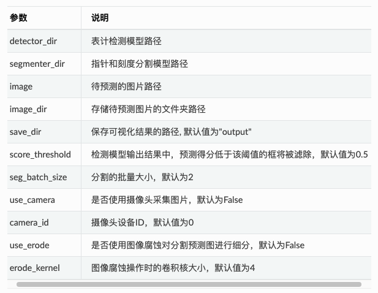
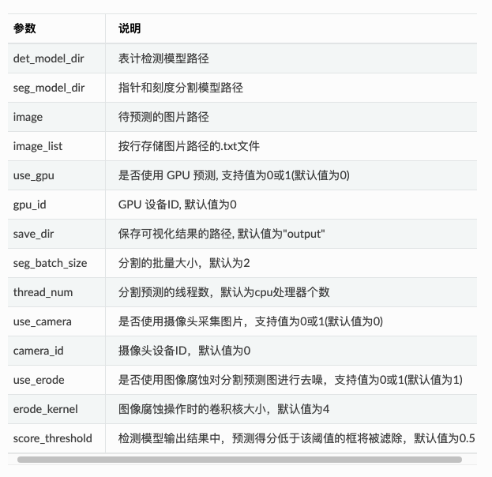
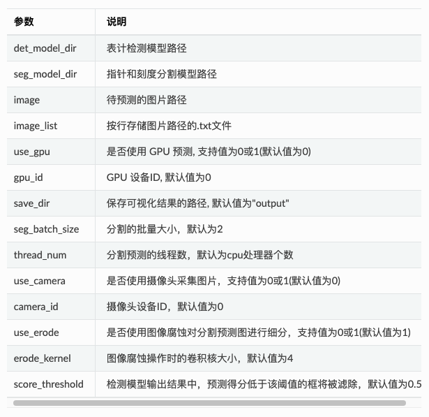

# 工业表计读数

本案例基于PaddleX实现对传统机械式指针表计的检测与自动读数功能，开放表计数据和预训练模型，并提供在windows系统的服务器端以及linux系统的jetson嵌入式设备上的部署指南。

## 读数流程

表计读数共分为三个步骤完成：

* 第一步，使用目标检测模型检测出图像中的表计
* 第二步，使用语义分割模型将各表计的指针和刻度分割出来
* 第三步，根据指针的相对位置和预知的量程计算出各表计的读数


* **表计检测**：由于本案例中没有面积较小的表计，所以目标检测模型选择性能更优的**YOLOv3**。考虑到本案例主要在有GPU的设备上部署，所以骨干网路选择精度更高的**DarkNet53**。
* **刻度和指针分割**：考虑到刻度和指针均为细小区域，语义分割模型选择效果更好的**DeepLapv3**。
* **读数后处理**：首先，对语义分割的预测类别图进行图像腐蚀操作，以达到刻度细分的目的。然后把环形的表盘展开为矩形图像，根据图像中类别信息生成一维的刻度数组和一维的指针数组。接着计算刻度数组的均值，用均值对刻度数组进行二值化操作。最后定位出指针相对刻度的位置，根据刻度的根数判断表盘的类型以此获取表盘的量程，将指针相对位置与量程做乘积得到表盘的读数。


## 表计数据和预训练模型

本案例开放了表计测试图片，用于体验表计读数的预测推理全流程。还开放了表计检测数据集、指针和刻度分割数据集，用户可以使用这些数据集重新训练模型。

| 表计测试图片                                                 | 表计检测数据集                                               | 指针和刻度分割数据集                                         |
| ------------------------------------------------------------ | ------------------------------------------------------------ | ------------------------------------------------------------ |
| [meter_test](https://bj.bcebos.com/paddlex/examples/meter_reader/datasets/meter_test.tar.gz) | [meter_det](https://bj.bcebos.com/paddlex/examples/meter_reader/datasets/meter_det.tar.gz) | [meter_seg](https://bj.bcebos.com/paddlex/examples/meter_reader/datasets/meter_seg.tar.gz) |

本案例开放了预先训练好的检测模型和语义分割模型，可以使用这些模型快速体验表计读数全流程，也可以直接将这些模型部署在服务器端或jetson嵌入式设备上进行推理预测。

| 表计检测模型                                                 | 指针和刻度分割模型                                           |
| ------------------------------------------------------------ | ------------------------------------------------------------ |
| [meter_det_inference_model](https://bj.bcebos.com/paddlex/examples/meter_reader/models/meter_det_inference_model.tar.gz) | [meter_seg_inference_model](https://bj.bcebos.com/paddlex/examples/meter_reader/models/meter_seg_inference_model.tar.gz) |


## 快速体验表盘读数

可以使用本案例提供的预训练模型快速体验表计读数的自动预测全流程。如果不需要预训练模型，可以跳转至小节`模型训练` 重新训练模型。

#### 前置依赖

* Paddle paddle >= 1.8.0
* Python >= 3.5
* PaddleX >= 1.0.0

安装的相关问题参考[PaddleX安装](../install.md)

#### 测试表计读数

step 1. 下载PaddleX源码:

```
git clone https://github.com/PaddlePaddle/PaddleX
```

step 2. 预测执行文件位于`PaddleX/examples/meter_reader/`，进入该目录：

```
cd PaddleX/examples/meter_reader/
```

预测执行文件为`reader_infer.py`，其主要参数说明如下：




step 3. 预测

若要使用GPU，则指定GPU卡号（以0号卡为例）：

```shell
export CUDA_VISIBLE_DEVICES=0
```
若不使用GPU，则将CUDA_VISIBLE_DEVICES指定为空:
```shell
export CUDA_VISIBLE_DEVICES=
```

* 预测单张图片

```shell
python reader_infer.py --detector_dir /path/to/det_inference_model --segmenter_dir /path/to/seg_inference_model --image /path/to/meter_test/20190822_168.jpg --save_dir ./output --use_erode
```

* 预测多张图片

```shell
python reader_infer.py --detector_dir /path/to/det_inference_model --segmenter_dir /path/to/seg_inference_model --image_dir /path/to/meter_test --save_dir ./output --use_erode
```

* 开启摄像头预测

```shell
python reader_infer.py --detector_dir /path/to/det_inference_model --segmenter_dir /path/to/seg_inference_model --save_dir ./output --use_erode --use_camera
```

## 推理部署

### Windows系统的服务器端安全部署

#### c++部署

step 1. 下载PaddleX源码:

```
git clone https://github.com/PaddlePaddle/PaddleX
```

step 2. 将`PaddleX\examples\meter_reader\deploy\cpp`下的`meter_reader`文件夹和`CMakeList.txt`拷贝至`PaddleX\deploy\cpp`目录下，拷贝之前可以将`PaddleX\deploy\cpp`下原本的`CMakeList.txt`做好备份。

step 3. 按照[Windows平台部署](../deploy/server/cpp/windows.md)中的Step2至Step4完成C++预测代码的编译。

step 4. 编译成功后，可执行文件在`out\build\x64-Release`目录下，打开`cmd`，并切换到该目录：

   ```
   cd PaddleX\deploy\cpp\out\build\x64-Release
   ```

   预测程序为paddle_inference\meter_reader.exe，其主要命令参数说明如下：



step 5. 推理预测：

  用于部署推理的模型应为inference格式，本案例提供的预训练模型均为inference格式，如若是重新训练的模型，需参考[部署模型导出](../deploy/export_model.md)将模型导出为inference格式。

  * 使用未加密的模型对单张图片做预测

  ```shell
  .\paddlex_inference\meter_reader.exe --det_model_dir=\path\to\det_inference_model --seg_model_dir=\path\to\seg_inference_model --image=\path\to\meter_test\20190822_168.jpg --use_gpu=1 --use_erode=1 --save_dir=output
  ```

  * 使用未加密的模型对图像列表做预测
  图像列表image_list.txt内容的格式如下，因绝对路径不同，暂未提供该文件，用户可根据实际情况自行生成：
  ```
  \path\to\images\1.jpg
  \path\to\images\2.jpg
  ...
  \path\to\images\n.jpg
  ```

  ```shell
  .\paddlex_inference\meter_reader.exe --det_model_dir=\path\to\det_inference_model --seg_model_dir=\path\to\seg_inference_model --image_list=\path\to\meter_test\image_list.txt --use_gpu=1 --use_erode=1 --save_dir=output
  ```

  * 使用未加密的模型开启摄像头做预测

  ```shell
  .\paddlex_inference\meter_reader.exe --det_model_dir=\path\to\det_inference_model --seg_model_dir=\path\to\seg_inference_model --use_camera=1 --use_gpu=1 --use_erode=1 --save_dir=output
  ```

  * 使用加密后的模型对单张图片做预测  

  如果未对模型进行加密，请参考[加密PaddleX模型](../deploy/server/encryption.html#paddlex)对模型进行加密。例如加密后的检测模型所在目录为`\path\to\encrypted_det_inference_model`，密钥为`yEBLDiBOdlj+5EsNNrABhfDuQGkdcreYcHcncqwdbx0=`；加密后的分割模型所在目录为`\path\to\encrypted_seg_inference_model`，密钥为`DbVS64I9pFRo5XmQ8MNV2kSGsfEr4FKA6OH9OUhRrsY=`  

  ```shell  
  .\paddlex_inference\meter_reader.exe --det_model_dir=\path\to\encrypted_det_inference_model --seg_model_dir=\path\to\encrypted_seg_inference_model --image=\path\to\test.jpg --use_gpu=1 --use_erode=1 --save_dir=output --det_key yEBLDiBOdlj+5EsNNrABhfDuQGkdcreYcHcncqwdbx0= --seg_key DbVS64I9pFRo5XmQ8MNV2kSGsfEr4FKA6OH9OUhRrsY=  
  ```

### Linux系统的jetson嵌入式设备安全部署

#### c++部署

step 1. 下载PaddleX源码:

```
git clone https://github.com/PaddlePaddle/PaddleX
```

step 2. 将`PaddleX/examples/meter_reader/deploy/cpp`下的`meter_reader`文件夹和`CMakeList.txt`拷贝至`PaddleX/deploy/cpp`目录下，拷贝之前可以将`PaddleX/deploy/cpp`下原本的`CMakeList.txt`做好备份。

step 3. 按照[Nvidia Jetson开发板部署](../deploy/nvidia-jetson.md)中的Step2至Step3完成C++预测代码的编译。

step 4. 编译成功后，可执行程为`build/meter_reader/meter_reader`，其主要命令参数说明如下：



step 5. 推理预测：

  用于部署推理的模型应为inference格式，本案例提供的预训练模型均为inference格式，如若是重新训练的模型，需参考[部署模型导出](../deploy/export_model.md)将模型导出为inference格式。

  * 使用未加密的模型对单张图片做预测

  ```shell
  ./build/meter_reader/meter_reader --det_model_dir=/path/to/det_inference_model --seg_model_dir=/path/to/seg_inference_model --image=/path/to/meter_test/20190822_168.jpg --use_gpu=1 --use_erode=1 --save_dir=output
  ```

  * 使用未加密的模型对图像列表做预测
  图像列表image_list.txt内容的格式如下，因绝对路径不同，暂未提供该文件，用户可根据实际情况自行生成：
  ```
  \path\to\images\1.jpg
  \path\to\images\2.jpg
  ...
  \path\to\images\n.jpg
  ```
  ```shell
  ./build/meter_reader/meter_reader --det_model_dir=/path/to/det_inference_model --seg_model_dir=/path/to/seg_inference_model --image_list=/path/to/image_list.txt --use_gpu=1 --use_erode=1 --save_dir=output
  ```

  * 使用未加密的模型开启摄像头做预测

  ```shell
  ./build/meter_reader/meter_reader --det_model_dir=/path/to/det_inference_model --seg_model_dir=/path/to/seg_inference_model --use_camera=1 --use_gpu=1 --use_erode=1 --save_dir=output
  ```

## 模型训练


#### 前置依赖

* Paddle paddle >= 1.8.0
* Python >= 3.5
* PaddleX >= 1.0.0

安装的相关问题参考[PaddleX安装](../install.md)

#### 训练

* 表盘检测的训练
```
python /path/to/PaddleX/examples/meter_reader/train_detection.py
```
* 指针和刻度分割的训练

```
python /path/to/PaddleX/examples/meter_reader/train_segmentation.py

```

运行以上脚本可以训练本案例的检测模型和分割模型。如果不需要本案例的数据和模型参数，可更换数据，选择合适的模型并调整训练参数。
