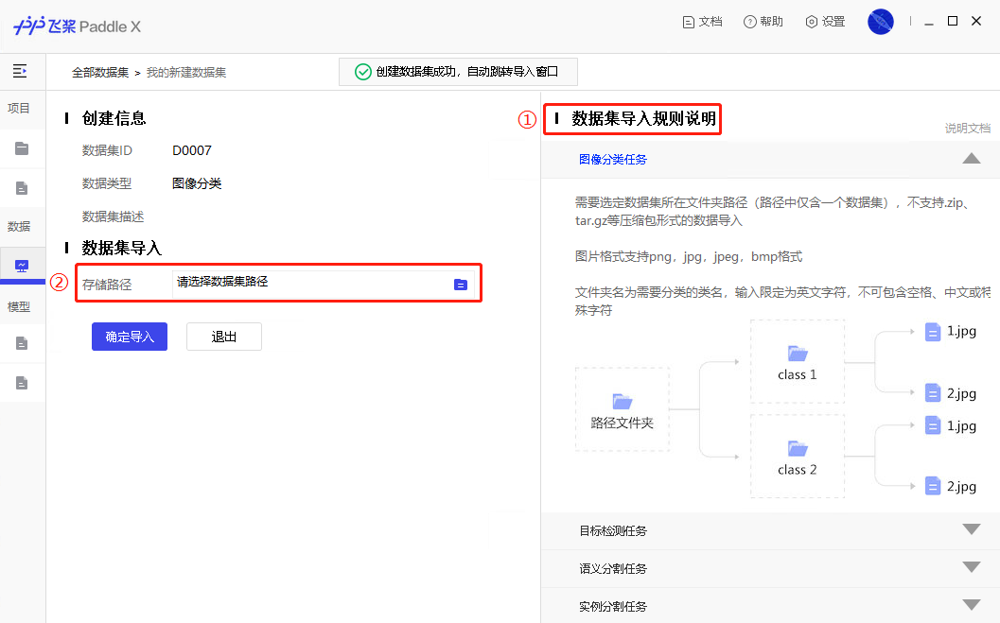
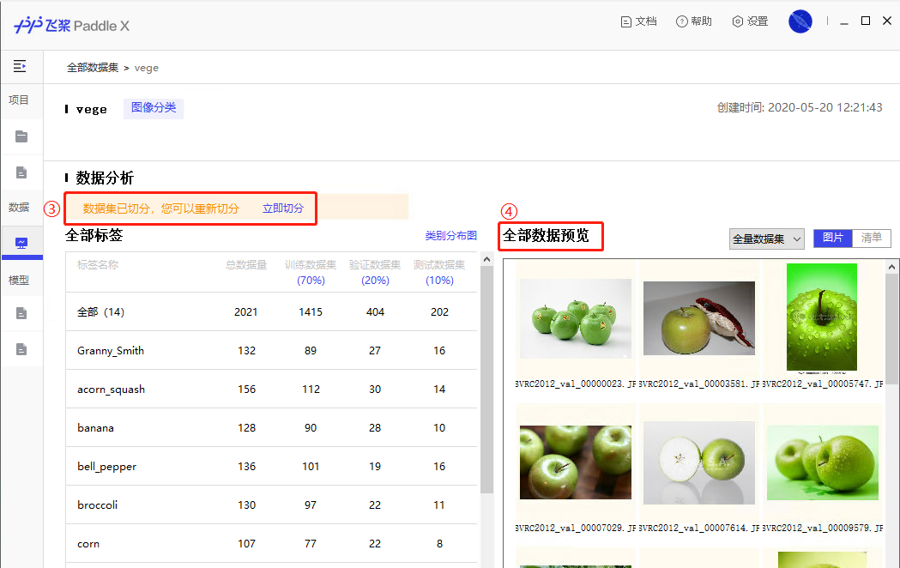
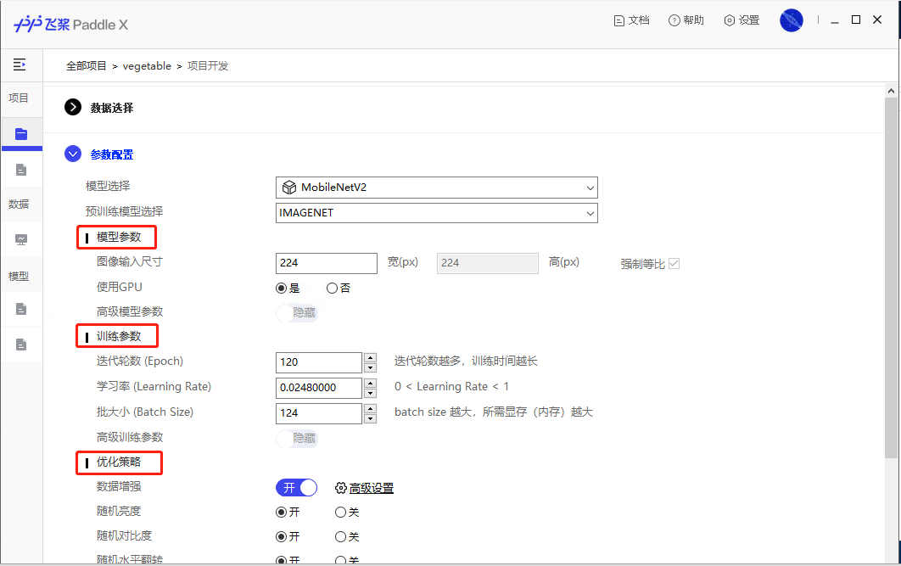
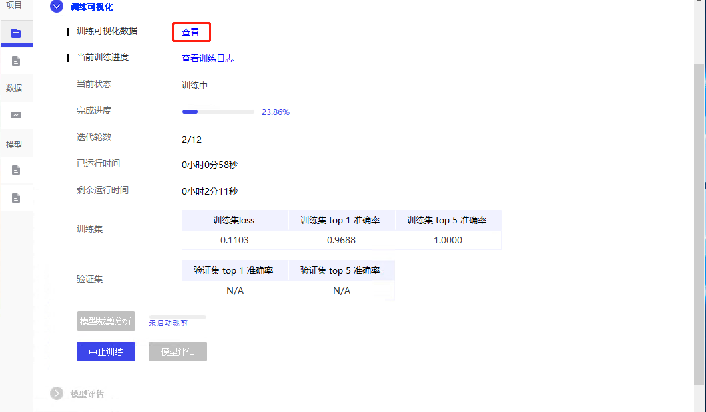
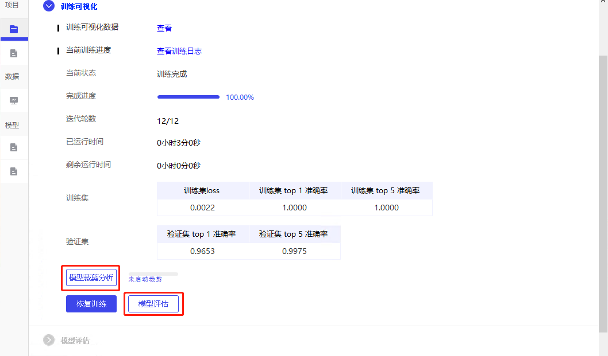
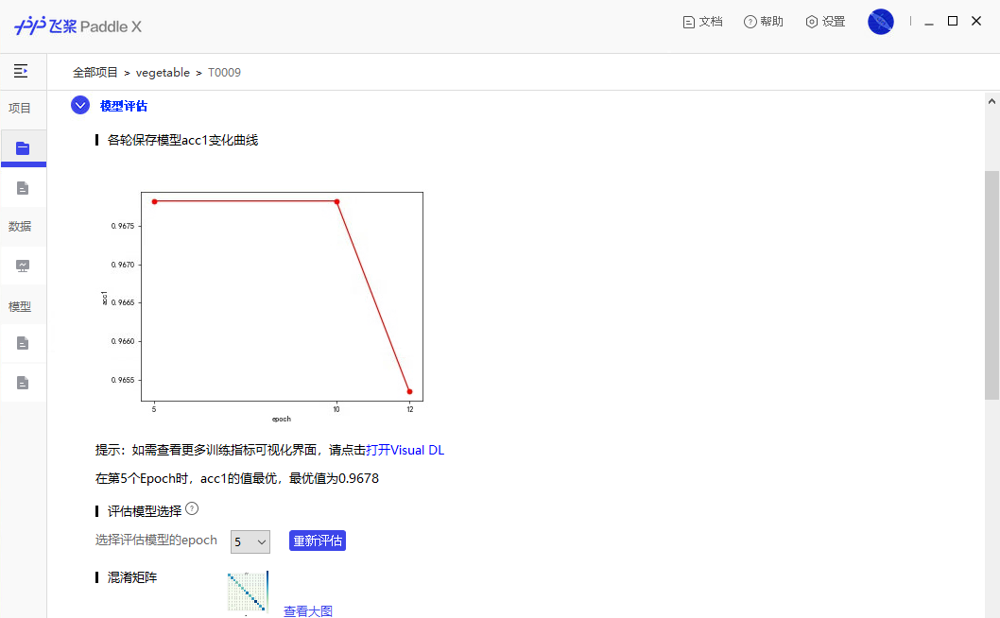
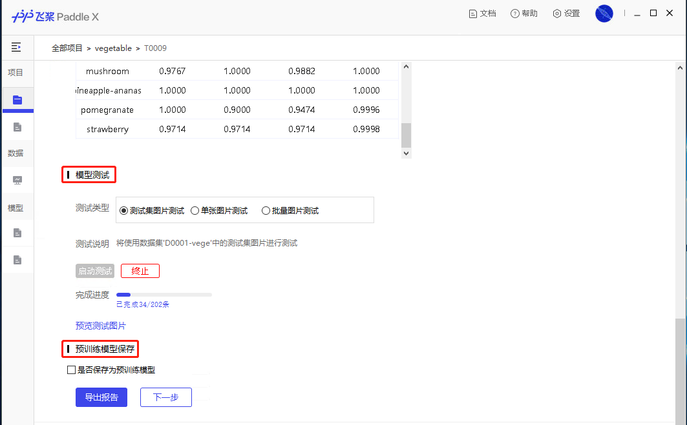

# PaddleX GUI tutorial

*Note: If your system is Mac OS 10.15.5 and later, after double-clicking the client icon, you need to execute sudo xattr -r -d com.apple. quarantine/Users/username/PaddleX in Terminal and wait a few seconds to start the client, where /Users/username/PaddleX is a folder path where you save PaddleX*

**Step 1: Prepare data**

Before starting model training, you need to annotate data in the corresponding format according to different task types. Currently, PaddleX supports [image classification], [object detection], [semantic segmentation] and [instance segmentation] task types. For the data processing methods of different types of tasks, view the [data annotation methods] (https://paddlex.readthedocs.io/zh_CN/latest/appendix/datasets.html). 

**Step 2: Import a dataset**

① After the data annotation is complete, you need to rename data and annotation documents according to different tasks and save them in the correct file.

② Create a dataset on the client, select a task type that matches data as well as a path corresponding to the dataset, and import the dataset.

③ After an imported dataset is selected, the client automatically checks whether data and annotation documents are compliant. After the check is successful, you can proportionally divide datasets into training sets, validation sets and test sets according to actual requirements.

④ You can preview your annotated dataset in the [Data Analysis] module according to the rules. Double-click a single image to zoom in on it.

**Step 3: Create a project**

① After the data import is complete, you can click [New Project] to create a project.

② You can select a task type for the project according to actual task requirements. Note that the dataset used also has a task type attribute. Both of them need to match each other.

**Step 4: Project development**

① **Data selection**: After the project creation is complete, you need to select a dataset which has been loaded into the client and checked. Click Next to enter the parameter configuration page.

② **Parameter configuration**: Mainly divided into three parts including **model parameters**, **training parameters** and **optimization policies**. You can select a model structure, a backbone network and the corresponding training parameters and optimization policies according to actual requirements to optimtimize the task effects. 

After the parameter configuration is complete, click Start Training to start training the model and perform effect evaluation.

③ **Training visualization**: You can view any parameter change, log details, and the current optimal training indexes of training and validation sets through VisualDL during training. You can suspend the model training process at any time by clicking "Suspend Training” during training.

After the model training is complete, you can choose to enter [Model Pruning Analysis] or directly enter [Model Evaluation].

④ **Model pruning**: If you want to reduce the model size and computation to improve the model inference performance on the device, you can use the model pruning policies provided by PaddleX. The pruning process is to analyze the sensitivity information of convolutional layers of a model, perform pruning in different proportions according to the impact of parameters on the model effects, and perform fine-tuned training to obtain the final pruned model.

⑤ **Model evaluation**: You can view the trained model effects in the model evaluation page. Evaluation methods include confusion matrix, precision and recall rate.

You can also select a [Test Dataset] reserved during [Dataset Splitting] or import one or more images from a local folder to test a trained model. Based on the test results, you can decide whether to save the trained model as a pre-training model and enter the model release page, or go back to the previous step to adjust the parameter configuration and perform re-training.

**Step 5: Model release**

After you are satisfied with the model effects, you can choose to release the model as a required version according to actual production environment requirements.

**If you have any questions or suggestions, do not hesitate to provide your feedback in the form of an issue or join PaddleX’s official QQ group (1045148026)**

