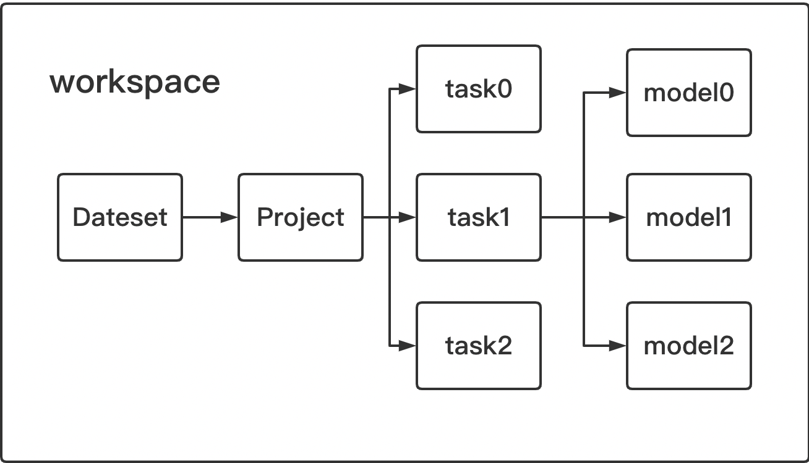
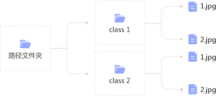
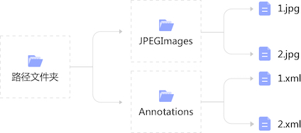
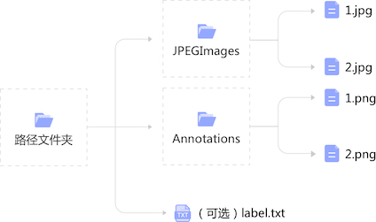
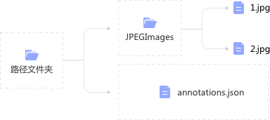

# RESTful API 二次开发简介
如图，PaddleX Restful主要由数据集(dataset)，项目(project)，任务(task)，模型(model)组成。上述模块数据保存在指定的工作空间(workspace)内，相应的结构化信息通过protobuf保存，[workspace的protobuf消息定义](./data_struct.md#Protobuf结构化数据)。  

  

**说明**：后续restful api通过`[Http request method] url`来表示  

## 流程介绍
对于通过Restful接口来进行二次开发，主要的流程如下：
- 1）：指定工作空间启动restful服务
- 2）：创建、导入并切分数据到数据集
- 3）：创建项目，绑定数据集到该项目，并根据项目类型获取训练的默认参数
- 4）：根据默认参数，在该项目下创建训练任务，调整参数(非必要)，开始训练模型
- 5）：对训练好的模型进行裁剪、评估、测试(非必要)
- 6）：保存或者发布训练好的模型

## 工作空间

通过如下命令在启动paddlex的restful服务时指定工作空间同时初始化工作空间，初始化工作空间主要做载入工作空间内已有的数据集、项目等模块的信息。初始化工作空间后就可以正常调用其他的restful api，所有新建的数据集、项目等数据都会保存在此工作空间目录下面  
```
 paddlex --start_restful --port [端口号] --workspace_dir [工作空间目录]
```  


## 数据集
可以通过调用["[post] /dataset"](./restful_api.md)接口创建数据集、创建数据集后会在工作空间内创建相应的文件夹，并保存数据集信息到按照workspace protobuf定义的变量中存储。创建数据集后可以通过["[put] \dataset"](./restful_api.md)接口导入数据集，目前仅支持从路径导入且数据集必须储存在后端。目前支持图像分类、目标检测、语义分割与实例分割四种数据集，具体格式如下  
### 图像分类
如图所示
- 文件夹名为需要分类的类名，输入限定为英文字符，不可包含：空格、中文或特殊字符；
- 图片格式支持png，jpg，jpeg，bmp格式  



### 目标检测
如图所示
- 图片文件名需要为"JPEGImages"，标签文件夹命名需要为"Annotations"
- 图片格式支持png，jpg，jpeg，bmp格式；标签文件格式为.xml  



### 语义分割
如图所示
- 图片文件名需要为"JPEGImages"，标签文件夹命名需要为"Annotations"
- 图片格式支持png，jpg，jpeg，bmp格式
- 标注需要与图片像素严格保持一一对应，格式只可为png。每个像素值需标注为[0,255]区间从0开始依序递增整数ID，除255外，标注ID值的增加不能跳跃。其中255表示模型中需忽略的像素，0为背景类标注。
- (可选)可以提供一份命名为"labels.txt"的包含所有标注名的清单  




### 实例分割
如图所示
- 图片文件名需要为"JPEGImages"，标签文件名需要为"annotations.json"
- 图片格式支持png，jpg，jpeg，bmp格式；标签文件格式为.json  



## 项目
可以通过调用["[post] /project"](./restful_api.md)接口创建项目，目前支持的项目类型有分类(classification)、检测(detection)、语义分割(segmentation)、示例分割(instance_segmentation)、摇杆分割(remote_segmentation)。对于新建的项目首先需要绑定项目类型对应的数据集，通过["[post] \workspace"](./restful_api.md)可以实现，注意对于摇杆分割项目数据集按照语义分割格式处理即可。一个项目可以包含多个任务。  

## 任务
在创建项目后,首先需要通过["[get] /project/task/params"](./restful_api.md)获得默认的训练参数,可以通过调用["[post] /project/task"](./restful_api.md)接口在项目中创建任务，目前任务可以包括：
- 训练(train):进行模型的训练
- 裁剪(prune):对训练好的模型模型进行裁剪
- 评估(eval):对训练好的模型进行评估
- 预测(predict):用训练好的模型进行预测，目前仅支持单张图片的预测

## 模型
目前PaddleX restful api支持将训练评估后的模型保存为预训练模型、导出inference模型、导出Padlle-lite模型、同时能支持模型的量化，可以通过调用["[post] /model](./restful_api.md)接口来完成这些功能
