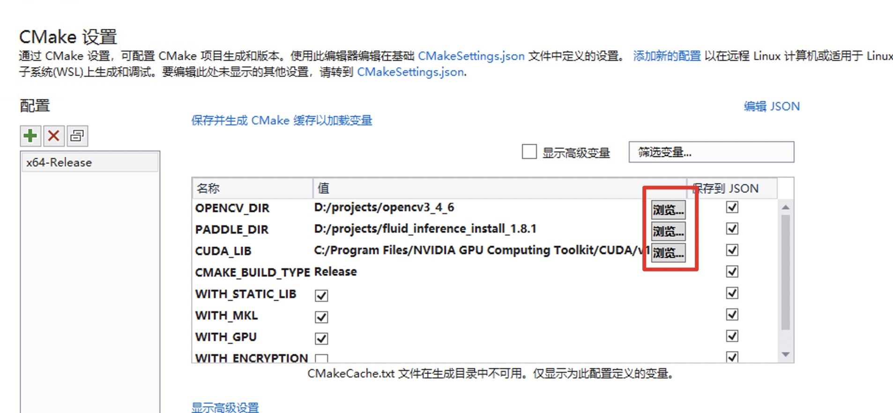

# Windows平台部署

## 说明
Windows 平台下，我们使用`Visual Studio 2019 Community` 进行了测试。微软从`Visual Studio 2017`开始即支持直接管理`CMake`跨平台编译项目，但是直到`2019`才提供了稳定和完全的支持，所以如果你想使用CMake管理项目编译构建，我们推荐你使用`Visual Studio 2019`环境下构建。

## 前置条件
* Visual Studio 2019
* CUDA 9.0 / CUDA 10.0, CUDNN 7+ （仅在使用GPU版本的预测库时需要）
* CMake 3.0+

请确保系统已经安装好上述基本软件，我们使用的是`VS2019`的社区版。

**下面所有示例以工作目录为 `D:\projects`演示**。

### Step1: 下载代码

下载源代码
```shell
d:
mkdir projects
cd projects
git clone https://github.com/PaddlePaddle/PaddleX.git
```

**说明**：其中`C++`预测代码在`PaddleX/deploy/cpp` 目录，该目录不依赖任何`PaddleX`下其他目录。


### Step2: 下载PaddlePaddle C++ 预测库 fluid_inference

PaddlePaddle C++ 预测库针对不同的`CPU`，`CUDA`，以及是否支持TensorRT，提供了不同的预编译版本，目前PaddleX依赖于Paddle1.7版本，以下提供了多个不同版本的Paddle预测库:

|  版本说明   | 预测库(1.8.1版本)  | 编译器 | 构建工具| cuDNN | CUDA
|  ----  |  ----  |  ----  |  ----  | ---- | ---- |
| cpu_avx_mkl  | [fluid_inference.zip](https://paddle-wheel.bj.bcebos.com/1.8.1/win-infer/mkl/cpu/fluid_inference_install_dir.zip) | MSVC 2015 update 3 | CMake v3.16.0 |
| cpu_avx_openblas  | [fluid_inference.zip](https://paddle-wheel.bj.bcebos.com/1.8.1/win-infer/open/cpu/fluid_inference_install_dir.zip) | MSVC 2015 update 3 | CMake v3.16.0 |
| cuda9.0_cudnn7_avx_mkl  | [fluid_inference.zip](https://paddle-wheel.bj.bcebos.com/1.8.1/win-infer/mkl/post97/fluid_inference_install_dir.zip) | MSVC 2015 update 3 | CMake v3.16.0 | 7.4.1 | 9.0 |
| cuda9.0_cudnn7_avx_openblas  | [fluid_inference.zip](https://paddle-wheel.bj.bcebos.com/1.8.1/win-infer/open/post97/fluid_inference_install_dir.zip) | MSVC 2015 update 3 | CMake v3.16.0 | 7.4.1 | 9.0 |
| cuda10.0_cudnn7_avx_mkl  | [fluid_inference.zip](https://paddle-wheel.bj.bcebos.com/1.8.1/win-infer/mkl/post107/fluid_inference_install_dir.zip) | MSVC 2015 update 3 | CMake v3.16.0 | 7.5.0 | 9.0 |


更多和更新的版本，请根据实际情况下载:  [C++预测库下载列表](https://www.paddlepaddle.org.cn/documentation/docs/zh/develop/advanced_guide/inference_deployment/inference/windows_cpp_inference.html)

解压后`D:\projects\fluid_inference*\`目录下主要包含的内容为：
```
├── \paddle\ # paddle核心库和头文件
|
├── \third_party\ # 第三方依赖库和头文件
|
└── \version.txt # 版本和编译信息
```

### Step3: 安装配置OpenCV

1. 在OpenCV官网下载适用于Windows平台的3.4.6版本， [下载地址](https://sourceforge.net/projects/opencvlibrary/files/3.4.6/opencv-3.4.6-vc14_vc15.exe/download)  
2. 运行下载的可执行文件，将OpenCV解压至指定目录，如`D:\projects\opencv`
3. 配置环境变量，如下流程所示  
    - 我的电脑->属性->高级系统设置->环境变量
    - 在系统变量中找到Path（如没有，自行创建），并双击编辑
    - 新建，将opencv路径填入并保存，如`D:\projects\opencv\build\x64\vc14\bin`

### Step4: 使用Visual Studio 2019直接编译CMake

1. 打开Visual Studio 2019 Community，点击`继续但无需代码`


2. 点击： `文件`->`打开`->`CMake`


选择项目代码所在路径，并打开`CMakeList.txt`：


3. 点击：`项目`->`CMake设置`


4. 点击`浏览`，分别设置编译选项指定`CUDA`、`OpenCV`、`Paddle预测库`的路径



依赖库路径的含义说明如下（带*表示仅在使用**GPU版本**预测库时指定, 其中CUDA库版本尽量对齐，**使用9.0、10.0版本，不使用9.2、10.1等版本CUDA库**）：

|  参数名   | 含义  |
|  ----  | ----  |
| *CUDA_LIB  | CUDA的库路径, 注：请将CUDNN的cudnn.lib文件拷贝到CUDA_LIB路径下 |
| OPENCV_DIR  | OpenCV的安装路径， |
| PADDLE_DIR | Paddle c++预测库的路径 |

**注意：**
1. 使用`CPU`版预测库，请把`WITH_GPU`的`值`去掉勾

2. 如果使用的是`openblas`版本，请把`WITH_MKL`的`值`去掉勾

3. Windows环境下编译会自动下载YAML，如果编译环境无法访问外网，可手动下载： [yaml-cpp.zip](https://bj.bcebos.com/paddlex/deploy/deps/yaml-cpp.zip)

yaml-cpp.zip文件下载后无需解压，在cmake/yaml.cmake中将`URL https://bj.bcebos.com/paddlex/deploy/deps/yaml-cpp.zip` 中的网址，改为下载文件的路径。


**设置完成后**, 点击上图中`保存并生成CMake缓存以加载变量`。

5. 点击`生成`->`全部生成`


### Step5: 预测及可视化


**在加载模型前，请检查你的模型目录中文件应该包括`model.yml`、`__model__`和`__params__`三个文件。如若不满足这个条件，请参考[模型导出为Inference文档](../deploy_python.html#inference)将模型导出为部署格式。**  

**注意：由于PaddleX代码的持续更新，版本低于1.0.0的模型（模型版本可查看model.yml文件中的version字段）暂时无法直接用于预测部署，参考[模型版本升级](../../upgrade_version.md)对模型版本进行升级。**

上述`Visual Studio 2019`编译产出的可执行文件在`out\build\x64-Release`目录下，打开`cmd`，并切换到该目录：

```
d:
cd D:\projects\PaddleX\deploy\cpp\out\build\x64-Release
```

编译成功后，预测demo的入口程序为`paddlex_inference\detector.exe`，`paddlex_inference\classifer.exe`，`paddlex_inference\segmenter.exe`，用户可根据自己的模型类型选择，其主要命令参数说明如下：

|  参数   | 说明  |
|  ----  | ----  |
| model_dir  | 导出的预测模型所在路径 |
| image  | 要预测的图片文件路径 |
| image_list  | 按行存储图片路径的.txt文件 |
| use_gpu  | 是否使用 GPU 预测, 支持值为0或1(默认值为0) |
| gpu_id  | GPU 设备ID, 默认值为0 |
| save_dir | 保存可视化结果的路径, 默认值为"output"，classfier无该参数 |


## 样例

可使用[小度熊识别模型](../deploy_python.md)中导出的`inference_model`和测试图片进行预测。

`样例一`：

不使用`GPU`测试图片  `\\path\\to\\xiaoduxiong.jpeg`  

```shell
.\\paddlex_inference\\detector.exe --model_dir=\\path\\to\\inference_model --image=D:\\images\\xiaoduxiong.jpeg --save_dir=output

```
图片文件`可视化预测结果`会保存在`save_dir`参数设置的目录下。


`样例二`:

使用`GPU`预测多个图片`\\path\\to\\image_list.txt`，image_list.txt内容的格式如下：
```
\\path\\to\\images\\xiaoduxiong1.jpeg
\\path\\to\\images\\xiaoduxiong2.jpeg
...
\\path\\to\\images\\xiaoduxiongn.jpeg
```
```shell
.\\paddlex_inference\\detector.exe --model_dir=\\path\\to\\inference_model --image_list=\\path\\to\\images_list.txt --use_gpu=1 --save_dir=output
```
图片文件`可视化预测结果`会保存在`save_dir`参数设置的目录下。
